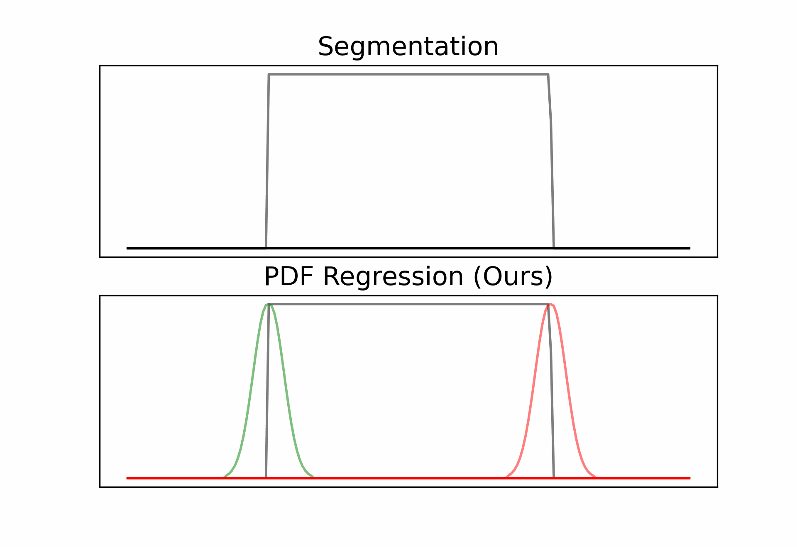

# Event Detection via Probability Density Function Regression


<!--  -->
<!--  -->

This repository may be used to train all the the models used for experiments in the [paper](https://arxiv.org/abs/2408.12792)

## Contents

- [Overview](#overview)
- [System Requirements](#system-requirements)
- [Installation Guide](#installation-guide)
- [Data Preparation](#data-preparation)
- [Training and Evaluation](#training-and-evaluation)
- [References](#references)


## Overview
This document describes the official software package developed for and used to create the general regression-based approach for sleep CPD. It features different models, like [PrecTime](https://arxiv.org/ftp/arxiv/papers/2302/2302.10182.pdf), 1D UNets, and Bidirectional RNNS.

This software allows the training of binary sleep CPD models using Child Mind Institute's [sleep detection dataset](https://www.kaggle.com/competitions/child-mind-institute-detect-sleep-states/data) and seizure event detection models using Physionet's [CHB-MIT Scalp EEG Database](https://archive.physionet.org/physiobank/database/chbmit/) from <cite>[Shoeb, Ali, 2009][2]</cite>. It features a command-line interface for training and evaluating models without needing to modify the underlying codebase.

## System Requirements
**Hardware Requirements**

For training our models from scratch,  we recommend using a Linux based computer with at least the following hardware specifications:

* 4+ CPU cores
* 26+ GiB RAM
* 5+ GiB physical storage space*
* 1 CUDA enabled GPU (please refer to [https://developer.nvidia.com/cuda-gpus](https://developer.nvidia.com/cuda-gpus) for a detailed list).

It is possible to train the model on smaller machines, and without GPUs, but doing so may take considerable time (1-2 min vs 8 sec per epoch). Likewise, more resources will speed up training. The data is automatically preprocessed in the script. However, if the preprocessing step exceeds the system memory, data should be preprocessed with the [```process_sleep_dataset```](https://github.com/clarkipeng/SleepRegressionCPD/blob/main/src/load_dataset.py#L214) function on virtual machine with more system memory, e.g., Kaggle's kernels or Google Colab's notebooks.

*The required hard-disk space depends on number of models/objectives used. The predictions for each model are cached, each new model/objective combination takes ~100Mb more disk memory each.

**Software Requirements:**

If you are going to run these scripts yourself from scratch, we highly recommend doing so on a GPU. In order to run the scripts with a GPU, the `pytorch` (`v2.2.2`) library is used. For this, the following additional software is required on your system:

* [NVIDIA GPU drivers](https://www.nvidia.com/drivers)
* [CUDA Toolkit](https://developer.nvidia.com/cuda-toolkit-archive)
* [cuDNN SDK](https://developer.nvidia.com/cudnn)

Please refer to [https://pytorch.org/get-started/locally/](https://pytorch.org/get-started/locally/) for additional details.

## Installation Guide
On a computer with `pip` installed, run the following commands to download the required packages.

```
git clone https://github.com/clarkipeng/EventDetectionPDF
cd EventDetectionPDF
pip install -r requirements.txt
```

## Data Preparation:

Download the [sleep detection dataset](https://www.kaggle.com/competitions/child-mind-institute-detect-sleep-states/data) or [seizure detection dataset](https://www.kaggle.com/datasets/werus23/chb-mit-scalp-eeg-database-seizure-only) from Kaggle.com. Place the downloaded dataset in a new directory called `data`. We require the directory structure to include the following:
```
path/to/repo/data
  train_series.parquet
  train_events.csv
```
or
```
path/to/repo/data
  seizure_256Hz_dataset
  seizure_events.csv
```

This repository also provides support for other datasets, such as the [bowshock detection dataset](https://archive.org/download/martian_bow_shock_dataset/martian_bow_shock_dataset.pkl) and [fraud detection dataset](https://archive.org/download/credit_card_fraud_dataset/credit_card_fraud_dataset.csv) as well as their [bowshock event labels](https://archive.org/download/martian_bow_shock_events/martian_bow_shock_events.csv) and [fraud event labels](https://archive.org/download/credit_card_fraud_events/credit_card_fraud_events.csv) provided by <cite>[Azib et al, 2023][1]</cite>. Place the downloaded datasets in the `data` directory. The required directory structure is:
```
path/to/repo/data
  martian_bow_shock_dataset.pkl
  martian_bow_shock_events.csv
  credit_card_fraud_dataset.csv
  credit_card_fraud_events.csv
```

For the use of external datasets, a ```DataClass``` enum and a ```torch.utils.data.Dataset``` constructor must be defined. ```DataClass``` lays out the parameters and types of the dataset, such as the number of features, whether events are point-based or time-interval-based, and the thresholds to use in evaluation. The ```Dataset``` constructor must construct the inputs to the model, such as the input timeseries and target series. 

More information can be found with the dataloader scripts found in [src](src).

## Training and Evaluation
We have 3 different scripts to aid in training and evaluation. These scripts are [train_all.py](train_all.py), [train.py](train.py), and [eval.py](eval.py).
After you have done all the necessary steps listed above, you are ready to train and evaluate the models. In order to train a model on a certain objective, you can simply run the following script with the names of the models and objectives: 

```
python train.py --dataset [dataset_name] --model [model_name] --objective [objective_name] --datadir [path_to_dataset]
```
Model choices vary: *rnn* (or *lstm* and *gru*), online forward-only RNNs (*frnn*, *flstm*, *fgru*), causal decoder-style Transformers (*causal_transformer*), *unet* (or *unet_t*), and *prectime*. More information about model choices can be found at [load_model.py](models/load_model.py). Objectives can be legacy MSE targets (*hard*, *gau*, *custom*), likelihood-based boundary density targets (*density_hard*, *density_gau*, *density_custom*), or segmentation targets (*seg*, *seg_weighted*, *seg_focal*). Segmentation models are evaluated with both threshold-crossing and peak-based post-processing variants.

In order to evaluate the trained models, run: 
```
python eval.py --dataset [dataset_name] --datadir [path_to_dataset]
```

In order to train the main model/objective matrix, run:
```
python train_all.py --dataset [dataset_name] --datadir [path_to_dataset]
```
For paper reruns, the recommended wrapper is:
```
python paper/run_experiments.py --datasets sleep --datadir data
python paper/run_experiments.py --datasets sleep --datadir data --write-script paper/generated_runs/sleep_full.sh
python paper/run_experiments.py --datasets sleep --datadir data --execute
```
The first command prints the planned matrix, the second writes an executable script for later GPU use, and the third executes it. See [paper/EXPERIMENTS.md](paper/EXPERIMENTS.md) for the full no-GPU-now, GPU-later runbook.

Each run writes checkpoints, out-of-fold predictions, and machine-readable result files under:
```
experiments/[dataset]/[model]/[objective]/seed_[seed]/
```
For interval datasets, evaluation tunes both unconstrained boundary peaks and an alternating onset/offset postprocessor.

After experiments finish, paper plots can be regenerated with:
```
python paper/make_plots.py --dataset sleep --results-root experiments
```

#### Example
Here is a minimal single-objective command. For paper claims, use the rerun matrix above rather than legacy example outputs.
```
python train.py --dataset sleep --model gru --objective density_custom --epochs 1 --folds 2 --datadir data
```

## References
[1]: https://github.com/menouarazib/eventdetector
[2]: https://archive.physionet.org/physiobank/database/chbmit/
